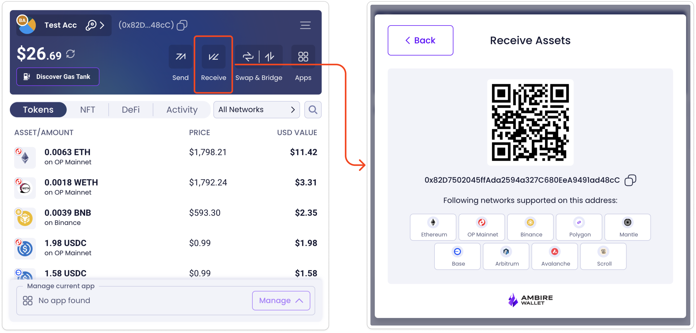
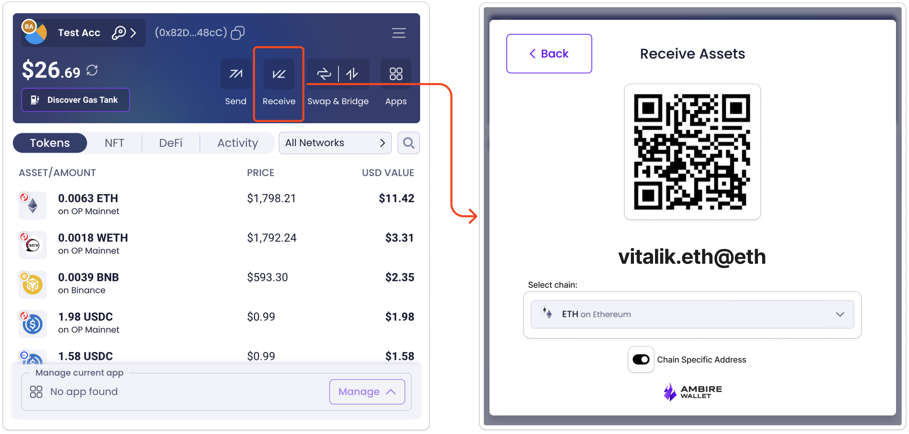

# Receive Modal Changes

Main component:
`src/web/components/ReceiveModal/ReceiveModal.tsx`

The current receive flow shows:

- QR code with the user's EVM address
- Text representation of the address for copying
- Icons for supported chains

**Proposed Changes**

We will enhance the receive modal to:

- Add a toggle to enable or disable "Chain Specific Address" (enabled by default)
- Display an interoperable address in the QR code and text field
- Add a chain selector to specify which chain the interoperable address should reference
- Maintain the existing view as a fallback option via the toggle

### Technical Implementation

- Create utility functions to generate interoperable addresses from EVM addresses and chain IDs
- Update the QR code generator to handle interoperable addresses
- Implement the toggle functionality to switch between address types
  - If chain-specific address is enabled: the chain selector is displayed
  - If chain-specific address is disabled: the chain selector is changed to a message informing users that this address can be used to receive funds on any EVM chain (or only on the chains supported by the wallet, TBD)
- Add chain selection functionality that updates the displayed interoperable address
  - The chain selector can be an independent component isolated from the general state of the app.
