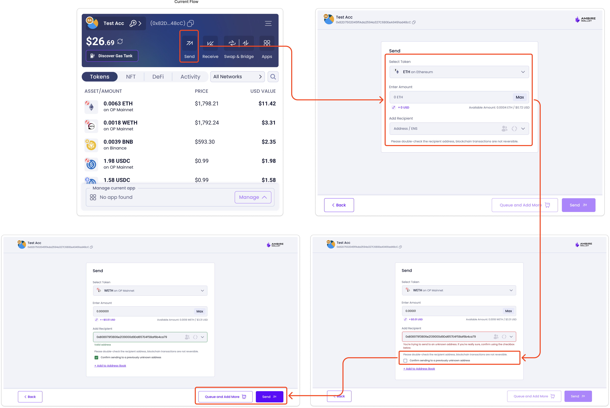
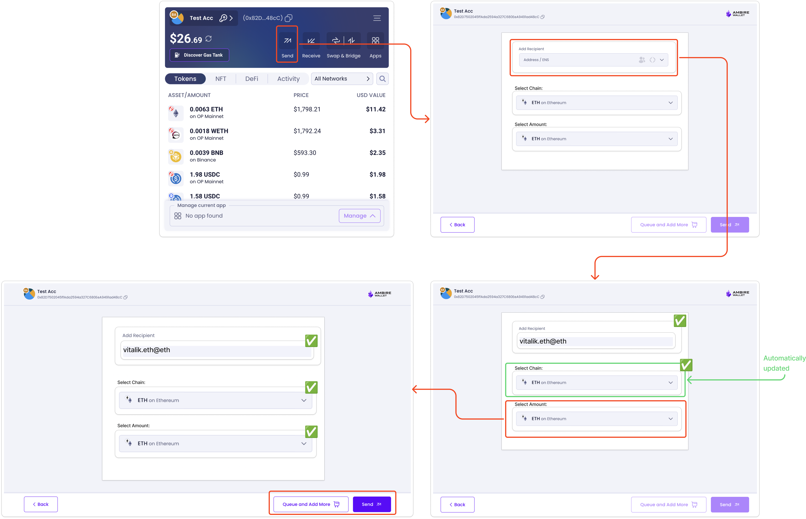

# Transfer Page (Part 1): Interoperable Address Support

Send Feature main components:

- Transfer Screen: `src/web/modules/transfer/screens/TransferScreen/TransferScreen.tsx`
- Send Form: `src/web/modules/transfer/components/SendForm/SendForm.tsx`
- Sign Account Operation: `src/web/modules/sign-account-op`
- Sending Transaction Modal (Benzin): `src/benzin/screens/BenzinScreen/components/Benzin/Benzin.tsx`

The current flow allows the users to:

1. Select a chain and a token
2. Select a token amount to send
3. Enter a recipient address (EVM address, ENS, or whitelisted address)

**Proposed Changes**

We will modify the flow to:

1. Enter a recipient address (adding support for interoperable addresses)
2. If an interoperable address is entered, automatically select the corresponding chain
3. Select a token and amount to send (filtered by the selected chain)

### UI Logic and Component Updates

- Reorder the UI elements to prioritize address entry first, followed by chain selection
- Create an address parser that can identify interoperable addresses
- Update the recipient input field to recognize and validate interoperable addresses
- Add validation logic for interoperable addresses
- Add visual indicators for interoperable addresses (similar to ENS or Whitelisted Addresses treatment)
- Implement chain auto-selection when an interoperable address is detected
- Update the UI to reflect the new address type with appropriate visual indicators
- Decouple Token selector from the chain selector
- Add logic to handle chain auto-selection when interoperable addresses are used
- Add an input with the token list for the corresponding chain
